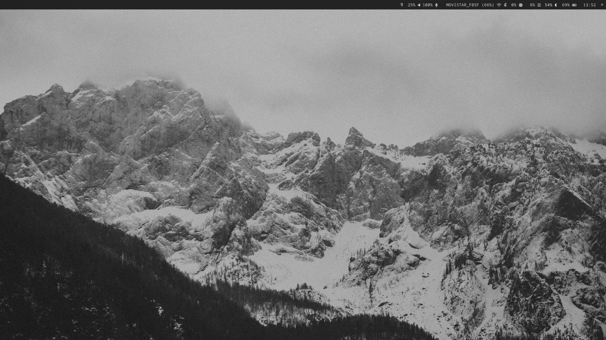

# monochrome-hyprland-ES

Un rice minimalista y monocromático para Hyprland en español. Gris, blanco y negro. Sin florituras.



---

## Componentes

| Rol | Herramienta |
|---|---|
| Compositor | Hyprland |
| Barra | Waybar |
| Wallpaper | Hyprpaper |
| Pantalla de bloqueo | Hyprlock |
| Login manager | SDDM (tema custom) |
| Terminal | Kitty |
| Shell | ZSH + Oh My Zsh |
| Launcher | Wofi |
| Capturas | Grim + Slurp |
| Notificaciones de volumen | SwayOSD |
| Gestor de archivos | Thunar |

---

## Instalación

### 1. Dependencias

```bash
sudo pacman -S hyprland waybar hyprpaper hyprlock sddm kitty zsh wofi grim slurp thunar
yay -S swayosd-git oh-my-zsh-git
```

### 2. Clonar el repo

```bash
git clone https://github.com/TUUSUARIO/monochrome-hyprland-ES ~/.dotfiles
```

### 3. Copiar los configs

```bash
cp ~/.dotfiles/hypr/* ~/.config/hypr/
cp ~/.dotfiles/waybar/* ~/.config/waybar/
cp ~/.dotfiles/kitty/* ~/.config/kitty/
cp ~/.dotfiles/.zshrc ~/
```

### 4. Permisos

```bash
chmod +x ~/.config/hypr/start.sh
```

### 5. SDDM tema

```bash
sudo cp -r ~/.dotfiles/sddm/monochrome /usr/share/sddm/themes/
sudo nano /etc/sddm.conf
```

```ini
[Theme]
Current=monochrome
```

---

## Atajos

| Atajo | Acción |
|---|---|
| `Super + Return` | Terminal |
| `Super + Q` | Cerrar ventana |
| `Super + R` | Launcher |
| `Super + E` | Gestor de archivos |
| `Super + F` | Pantalla completa |
| `Super + V` | Flotante |
| `Super + L` | Bloquear pantalla |
| `Super + M` | Salir |
| `Super + 1-5` | Cambiar workspace |
| `Super + Shift + 1-5` | Mover ventana |
| `Print` | Captura de área |
| `Shift + Print` | Pantalla completa |

---

## Notas

- El wallpaper no está incluido. Cambia la ruta en `hypr/hyprpaper.conf` y `hypr/start.sh`.
- `welcome.py` requiere Python 3 y conexión a internet para el tiempo (wttr.in).
- Probado en EndeavourOS con Hyprland 0.54.

---

## Inspiración

- [r/unixporn](https://www.reddit.com/r/unixporn)
- [Hyprland Wiki](https://wiki.hypr.land)
